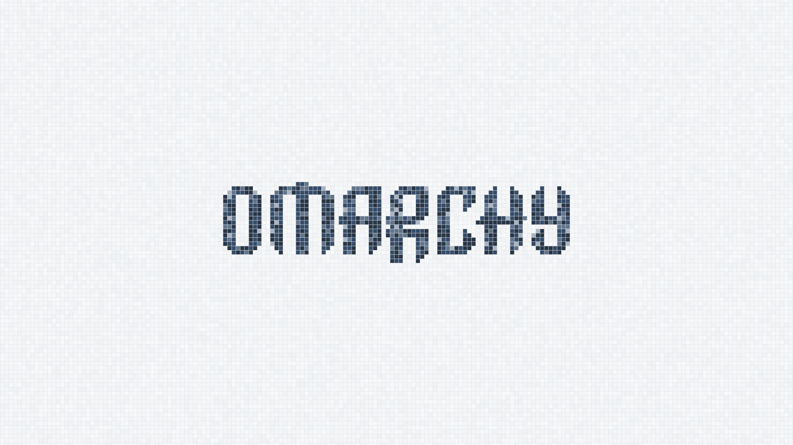

# Blue Mosaic

A light theme for Omarchy with pale mosaic tiles, graphite-blue motifs, and a matching interface palette.

## Install

For **Omarchy 4 with Omarchy Shell**. Copy this repository's URL into Omarchy's theme installer, then select **Blue Mosaic**.

## The theme

- A continuous mosaic floor with two Omarchy motifs: logo and wordmark.
- A transparent top bar that blends into the tiled background.
- Solid, cool-white windows and menus with blue accents and slate borders.
- A graphite-blue terminal palette and Adwaita icons.

## Wallpapers

Both wallpapers are **3840 × 2160**, with editable SVG sources included.

[Logo](backgrounds/01-blue-mosaic-logo-4k.png) · [Wordmark](backgrounds/02-blue-mosaic-wordmark-4k.png)

## License

[MIT](LICENSE) · [Omarchy artwork attribution](THIRD_PARTY_NOTICES.md)

[Development and optional setup](DEVELOPMENT.md)
